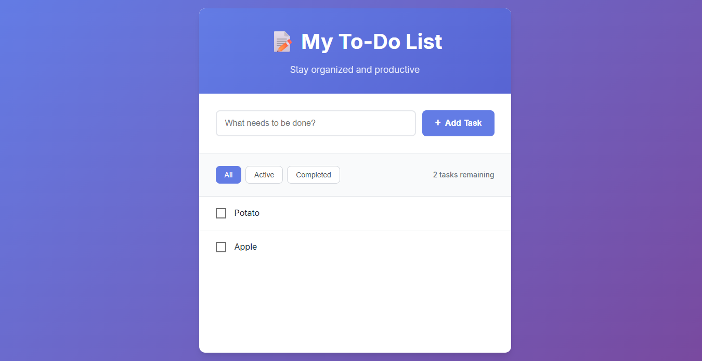

# 📝 Modern To-Do List - Beginner Friendly


A beautiful, responsive to-do list application built with vanilla HTML, CSS, and JavaScript. This project is designed to be **beginner-friendly** with extensive comments and clear code structure for learning purposes.

## 📸 Screenshots

<div align="center">
  
  <p><em>Clean and modern to-do list interface with gradient background and intuitive controls</em></p>
</div>

## 🚀 Live Demo

[View Live To-Do List](https://to-do-list-shibam.netlify.app/)

## ✨ Features

- **Add Tasks** - Quick task creation with enter key support
- **Edit Tasks** - Modal-based editing with keyboard shortcuts
- **Delete Tasks** - Safe deletion with confirmation dialogs
- **Mark Complete** - Visual checkbox completion with strikethrough
- **Filter Tasks** - View All, Active, or Completed tasks
- **Task Counter** - Shows remaining active tasks
- **Data Persistence** - Automatic saving to browser localStorage
- **Responsive Design** - Works perfectly on desktop and mobile
- **Modern UI** - Beautiful gradients, shadows, and animations

## 🎓 Perfect for Learning

This code is specifically written to be **beginner-friendly**:
- ✅ **Extensive comments** explaining every function and CSS rule
- ✅ **Clear section headers** organizing code logically
- ✅ **Simple language** avoiding complex technical jargon
- ✅ **Step-by-step explanations** for complex operations
- ✅ **Modern best practices** demonstrated in an understandable way

## 🚀 Getting Started

### Simple Setup
1. Download or clone this repository
2. Double-click `index.html` to open it in your web browser
3. Start adding tasks immediately!

**That's it!** Since this is a pure HTML/CSS/JavaScript project with no external dependencies, it runs directly in your browser without needing any server setup.

## 🛠️ Technologies Used

- **HTML5** - Semantic markup with clear comments
- **CSS3** - Modern styling with detailed explanations
- **Vanilla JavaScript** - ES6+ class structure with beginner-friendly comments
- **localStorage API** - Browser storage for data persistence

## 📚 Learning Highlights

### HTML Structure
- Semantic HTML elements with descriptive comments
- Form handling and accessibility features
- Modal implementation for editing tasks

### CSS Features
- CSS Custom Properties (variables) for easy theming
- Flexbox layout with clear explanations
- Responsive design with mobile-first approach
- Smooth animations and hover effects
- Modern gradient backgrounds and shadows

### JavaScript Concepts
- ES6 Class structure with detailed comments
- Event handling and DOM manipulation
- Local storage for data persistence
- Array methods (filter, find, forEach)
- Template literals for dynamic HTML
- Error handling with try-catch blocks

## 📁 Project Structure

```
to-do-list-shibam/
├── 📄 index.html          # Main HTML with beginner-friendly comments (3.8KB)
├── 🎨 styles.css          # CSS with detailed explanations (13.3KB)
├── ⚡ todo.js            # JavaScript with extensive comments (13.0KB)
├── 📸 screenshot/         # Project screenshots
│   └── to-do-list-shibam.png
├── 📖 README.md          # This comprehensive documentation (4.5KB)
├── 📜 LICENSE            # MIT License for open source usage
└── 🚫 .gitignore          # Git ignore file for version control
```

## 🛠️ Technologies Used

<table>
<tr>
<td align="center"><br><b>HTML5</b></td>
<td align="center"><br><b>CSS3</b></td>
<td align="center"><br><b>JavaScript</b></td>
<td align="center"><br><b>Bootstrap</b></td>
</tr>
</table>

### File Details
- **index.html** - Clean HTML structure with semantic elements and accessibility features
- **styles.css** - Modern CSS with custom properties, flexbox, and responsive design
- **todo.js** - ES6 class-based JavaScript with localStorage and comprehensive error handling
- **.gitignore** - Standard ignore patterns for web development projects
- **LICENSE** - MIT License allowing free use, modification, and distribution
- **README.md** - Complete documentation with learning resources and setup instructions

## 📝 Commit History

This project was developed through 5 key commits:

1. **init** - Initial project setup and basic file structure
2. **add todo** - Core functionality for adding new tasks
3. **edit/delete** - Task editing and deletion features with modals
4. **filters** - Filter system for All, Active, and Completed tasks
5. **docs** - Documentation updates and project finalization

## 🎨 Design Features

- **Purple gradient background** with modern appeal
- **Card-based layout** with subtle shadows
- **Smooth transitions** on all interactive elements
- **Responsive breakpoints** for mobile devices
- **Hover effects** providing visual feedback
- **Clean typography** using system fonts

## 🔧 Easy Customization

The app uses CSS custom properties for easy theming. Change colors by modifying the `:root` variables in `styles.css`:

```css
:root {
  --primary-color: #667eea;    /* Main blue color for buttons */
  --success-color: #48bb78;    /* Green for completed tasks */
  --danger-color: #f56565;     /* Red for delete buttons */
  --warning-color: #ed8936;    /* Orange for edit buttons */
  /* ... and many more clearly labeled variables */
}
```

## 📱 Browser Compatibility

- Chrome 60+ ✅
- Firefox 55+ ✅
- Safari 12+ ✅
- Edge 79+ ✅

## 🎯 What You'll Learn

By studying this code, you'll understand:
- How to structure a complete web application
- Modern CSS techniques and best practices
- JavaScript class-based programming
- Event handling and DOM manipulation
- Local storage for data persistence
- Responsive web design principles
- Code organization and commenting

## 🤝 Contributing

This project welcomes contributions, especially those that improve the learning experience for beginners!

## 📝 License

This project is open source and available under the MIT License. Perfect for learning, modifying, and sharing!